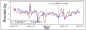
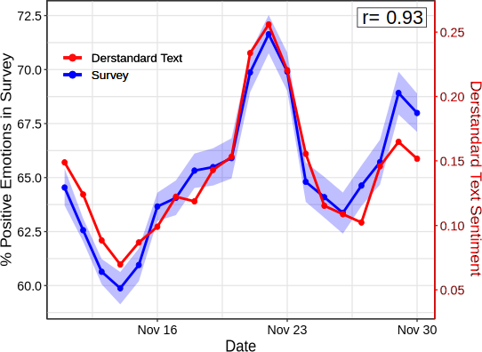

```{r xaringan-themer, include=FALSE, warning=FALSE}
#This block contains the theme configuration for the CSS lab slides style
library(xaringanthemer)
library(showtext)
style_mono_accent(
  base_color = "#5c5c5c",
  text_font_size = "1.5rem",
  header_font_google = google_font("Arial"),
  text_font_google   = google_font("Arial", "300", "300i"),
  code_font_google   = google_font("Fira Mono")
)
```

```{r setup, include=FALSE}
options(htmltools.dir.version = FALSE)
```


layout: true
<div class="my-footer"><span>David Garcia - CASCB Seminar</span></div> 

---

background-image: url(figures/AboutUS.svg)
background-size: 98%

---

background-image: url(figures/VennV2-1.svg)
background-size: 98%

---

background-image: url(figures/VennV2.svg)
background-size: 98%

---

# Our Research Topics


---

# Outline

## 1. Collective Emotions and Social Resilience

## 2. Validating Social Media Macroscopes of Emotions

## 3. Detecting Individual Emotions in Social Media

---

## The Social Function of Collective Emotions

<center>
```{r, echo=FALSE, out.width=900}
knitr::include_graphics("figures/ColectiveEmotions.png")
```
</center>

- **Theory of collective effervescence (Durkheim, 1912):**
Shared emotions generate social identity, reinforce shared beliefs, and lead to higher solidarity

- **Collective emotions (von Scheve and Salmela, 2014):**   
Emotional states shared by a large amount of people at the same time


---

background-size: 40%
background-image: url(figures/Trauma.png)
background-position: 90% 60%


## Emotional Responses to Collective Traumas

**How do societies respond to traumatic events?**  
**Is there a social function of collective emotions?**
.pull-left[
- Emotional synchronization: Experience of simultaneous negative emotions

- Collective emotion lasts longer than individual emotional reactions

- Individuals that participate in the collective emotions show higher levels of long-term solidarity ]

---

## Twitter Digital Traces after a Terrorist Attack

Focus on Paris Attacks of of Nov 13, 2015  
Removed bots, news media, and organizations. Final sample of 62,114 users  
Retrieved historical timeline of users. Total of more than 27 Million tweets (no RT)
<center>
```{r, echo=FALSE, out.width=900}
knitr::include_graphics("figures/ParisCase.png")
```

---

## Linguistic Signals

**Linguistic Inquiry and Word Count, LIWC (pronounced “Luke”)**  
- Simple word matching method  
- Validated by psychologists, years of implementation (2001-2015)  
- Multiple classes, calibrated for netspeak and neologisms


.pull-left[
```{r, echo=FALSE, out.width=1000}
knitr::include_graphics("figures/LIWC.png")
```
]
.pull-right[
**LIWC classes in this study:**  
Positive Affect, Negative Affect  
Anxiety, Sadness, Anger  
Social processes  
Prosocial terms (Frimer, et. al, 2014)  
French values (libert*, egalit*, fraternit*)
]

---

## Evidence of Collective Emotions
<center>
```{r, echo=FALSE, out.width=750}
knitr::include_graphics("figures/TS.png")
```
</center>

---

### Collective Dynamics of Social Resilience Indicators
<center>
```{r, echo=FALSE, out.width=720}
knitr::include_graphics("figures/TS2.png")
```
</center>


---

# Emotions and Prosocial Language

.pull-left[
<center>
```{r, echo=FALSE, out.width=470}
knitr::include_graphics("figures/TS3.png")
```
</center>
]

.pull-right[
Division of users into two groups based on their emotional expression two weeks after the attacks

Frequency of social process terms:
- Very similar before the attacks
- Strong difference after the attacks
- Difference lasts for months

Similar effect for prosocial terms and shared values terms
]

---

## What we learned about collective emotions

- Terrorist attacks trigger collective emotions that we can observe online

- Terms related to social resilience increase after collective emotions

- Individuals expressing stronger emotions used on average more terms related to social processes, prosocial behavior, and shared values

- Collective emotions are not just venting, they can keep us together

- Negative effects: inter-group conflict, intolerance, short-term orientation...

- Online interactive visualization at: http://dgarcia.eu/ParisAttacks.html

[**Collective Emotions and Social Resilience in the Digital Traces After a Terrorist Attack. David Garcia Bernard Rimé. Psychological Science (2019)**](https://journals.sagepub.com/doi/full/10.1177/0956797619831964)

---

## Validating Social Media Macroscopes of Emotions

## 1. Collective Emotions and Social Resilience

## *2. Validating Social Media Macroscopes of Emotions*

## 3. Detecting Individual Emotions in Social Media

---

layout: true
<div class="my-footer"><span>
<a href=https://arxiv.org/abs/2107.13236> Social media emotion macroscopes reflect emotional experiences in society at large. David Garcia, Max Pellert, Jana Lasser, Hannah Metzler. https://arxiv.org/abs/2107.13236 (2021)</a></span></div>

---

# Social Media Macroscopes


.pull-left[
```{r, echo=FALSE, out.width=500}
knitr::include_graphics("figures/earth.svg")
``` 
]

.pull-right[
Concerns about social media     macroscopes:
1. Representation issues

2. Performative behavior

3. Measurement error and bias

4. Researcher degrees of freedom
]

---


# Validating a UK emotion macroscope

```{r, echo=FALSE, out.width=975, fig.align='center'}
knitr::include_graphics("figures/MacroTest2.svg")
```

---

# Sadness in Twitter and YouGov

```{r, echo=FALSE, out.width=1200, fig.align='center'}
knitr::include_graphics("figures/Sadness.svg")
```

- Similar results with dictionary-based and supervised methods (r~0.65)
---
# Anxiety in Twitter and YouGov

```{r, echo=FALSE, out.width=1200, fig.align='center'}
knitr::include_graphics("figures/Anxiety.svg")
```

- Improvement thanks to gender information in tweets

---
# Joy in Twitter and YouGov

```{r, echo=FALSE, out.width=1200, fig.align='center'}

```

- Good correlation with supervised method but no correlation with dictionary-based method

---

layout: true
<div class="my-footer"><span>
<a href=https://www.nature.com/articles/s41598-022-14579-y>
Validating daily social media macroscopes of emotions. Max Pellert, Hannah Metzler, Michael Matzenberger, David Garcia. Scientific Reports (2022)</a></span></div>

---

## Reproducing with an Austrian daily macroscope

.pull-left[

- 20-day emotion survey in derstandard.at (N=268,128)
- Daily frequency, 3-day windows

- Text from Der Standard forum (N=452,013)

- Austrian tweets (N=515,187) filtered as UK macroscope

- Compared dictionary-based (LIWC) and supervised model (GS)

]
.pull-right[
```{r, echo=FALSE, out.width=900}

```
]

---

## Online Media for Social Sensing of Emotions

```{r, echo=FALSE, out.width=850, fig.align='center'}
knitr::include_graphics("figures/socialsensing.svg")
```

---

## Social media macroscopes: Take-home message


<a href=https://www.nature.com/articles/s41598-022-14579-y>
Validating daily social media macroscopes of emotions. Max Pellert, Hannah Metzler, Michael Matzenberger, David Garcia. Scientific Reports (2022)

<a href=https://arxiv.org/abs/2107.13236> Social media emotion macroscopes reflect emotional experiences in society at large. David Garcia, Max Pellert, Jana Lasser, Hannah Metzler. https://arxiv.org/abs/2107.13236 (2021)

<a href=https://worldhappiness.report/ed/2022/using-social-media-data-to-capture-emotions-before-and-during-covid-19/> Using social media data to capture emotions before and during COVID-19. Hannah Metzler, Max Pellert, David Garcia. World Happiness Report (2022)
---


## Detecting Individual Emotions in Social Media

## 1. Collective Emotions and Social Resilience

## 2. Validating Social Media Macroscopes of Emotions

## *3. Detecting Individual Emotions in Social Media*

---


layout: true
<div class="my-footer"><span><a href="https://arxiv.org/abs/2304.10973v1"> LEIA: Linguistic Embeddings for the Identification of Affect. Segun Taofeek Aroyehun, Lukas Malik, Hannah Metzler, Nikolas Haimerl, Anna Di Natale, David Garcia. Arxiv preprint (2023)</a></span></div> 

---

## Challenges in individual emotion detection

**The problem with sentiment analysis: Writer versus reader emotions**

```{r, echo=FALSE, out.width=950, fig.align='center'}
knitr::include_graphics("figures/communication.png")
```

Current sentiment analysis approaches assume that the **ground truth** is an annotation of emotions by **a reader**, often a student or a crowdsourcing worker

---

### LEIA: Linguistic Embeddings for the Identification of Affect


---

# Datasets summary

- Vent dataset samples:


- Out-of-domain validation datasets:
<center>  </center>

---

# Results in Vent

<center>  </center>

---

# Out-of-domain results


- LEIA is best or tied with the best in all out-of-domain tests
- LEIA is best or tied with the best in all emotions except Fear in TEC
- Performance is very high for two reference standards: enISEAR and SemEval

Try it yourself:
https://huggingface.co/saroyehun/LEIA-large

Peprint to be posted soon - LEIA: Linguistic Embeddings for the Identification of Affect. S. Aroyehun, L. Malik, H. Metzler, N. Haimerl, A. Di Natale, D. Garcia

---


# Summary

- **Understanding Collective Emotions through Social Media**
  - Evidence of collective emotions after the Paris Attacks of Nov. 2015
  - Longer effect in prosocial language linked to the collective emotion
  

- **Social Media Macroscopes of Emotions**
  - Macroscopes of emotions in the UK agree with survey data
  - Replication in Austria in Der Standard


- **Detecting Individual Emotions from Social Media Text**
  - LEIA as an AI approach to estimate self-labelled emotions
  - Good performance in out-of-domain tests

.center[**More at: [www.dgarcia.eu](https://dgarcia.eu) and [@dgarcia_eu](https://twitter.com/dgarcia_eu)**  

**Thanks for listening!**
]

